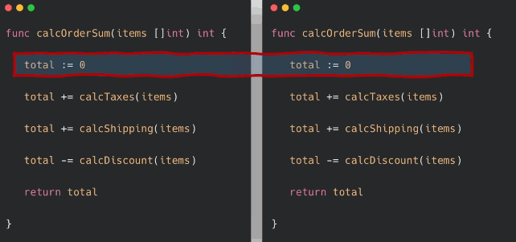
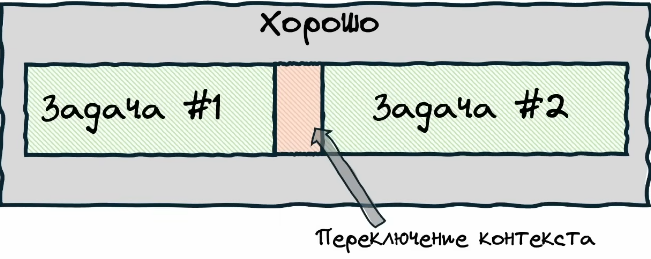
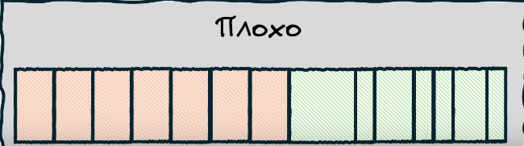
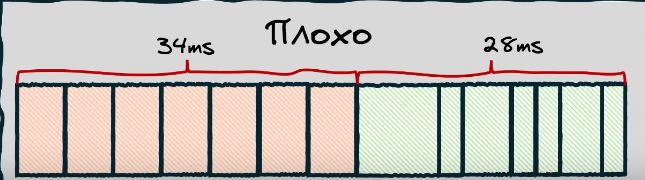

# Параллелизм и конкурентность

## Основные практические действия

**группы ожидания**
```go
package main

import (
	"fmt"
	"sync"
)

func makeDrink(barista string, wg *sync.WaitGroup) {
	//defer wg.Done()
	fmt.Printf("Barista %s sayd: Dirink is ready\n", barista)
	wg.Done()
}

func main() {
	var wg sync.WaitGroup

	wg.Add(1)
	go makeDrink("Artem", &wg)
	wg.Add(1)
	go makeDrink("Elena", &wg)
	wg.Add(1)
	go makeDrink("Alex", &wg)

	wg.Wait()

	fmt.Println("Main End")
}
```
**Использование каналов**

```go
package main

import (
	"fmt"
	"sync"
)

func makeDrink(barista string, wg *sync.WaitGroup, data chan string) {
	defer wg.Done()
	
	data <- fmt.Sprintf("Barista %s sayd: Dirink is ready\n", barista)
}

func main() {
	var wg sync.WaitGroup
	data := make(chan string, 3)

	wg.Add(1)
	go makeDrink("Artem", &wg, data)
	wg.Add(1)
	go makeDrink("Elena", &wg, data)
	wg.Add(1)
	go makeDrink("Alex", &wg, data)

	wg.Wait()
	close(data) // закрываем канал, чтобы range завершился

	for result := range data {
		fmt.Println(result)
	}

}
```


// Доделать позже
# Параллелизм и конкурентность

Источники:
- [Планировщик Go — самый подробный гайд простым языком](https://www.youtube.com/watch?v=kedW1xO3Zbo)

## В чём состоит задача планировщика конкурентной работы в Go? 

Это удовлетворение трем требованиям: 

- Задействовать все ядра. Не должно быть ситуации, при которой одно ядро простаивает, в то время как другое перегружено очередью задач. 
- Конкурентность должна быть дешёвой с точки зрения использования ресурсов ОС, чтобы можно было создавать десятки тысяч горутин без значительных накладных расходов. 
- Простота: запускать конкурентный код должно быть так же просто, как вызвать обычную функцию. 

## Краткий ликбез. Как устроена работа конкурентности на уровне ОС.

Настоящая параллельность выполнения кода возможна только при наличии нескольких ядер. Если же ядро одно, задачи выполняются последовательно, с переключением между ними в пределах одного потока.

### Различие между конкурентностью и параллельностью

**Конкурентность**

Допустим, у нас есть две функции a() и b(), каждая из которых содержит по пять строк кода. При конкурентном выполнении планировщик может сначала выполнить первые две строки a(), затем переключиться на b() и выполнить, скажем, три строки, затем снова вернуться к a() и продолжить выполнение.

Это не обязательно означает параллельное выполнение — код может выполняться на одном ядре, просто с переключением контекста между задачами.

<p align="center">
  
</p>

**Параллельность**

Параллельность означает одновременное выполнение двух участков кода на разных ядрах процессора. В этом случае действительно две строки кода могут исполняться физически в одну и ту же единицу времени — при наличии нескольких ядер.

<p align="center">
  
</p>

> Кратко:
> - Конкурентность — это иллюзия одновременности.
> - Параллельность — это фактическая одновременность.


### Планировщик

Итак, у нас есть один процессор. У этого ядра есть всего один слот для выполнения задачи — выполнять две задачи одновременно оно не может. Также у процессора есть очередь, в которой ожидают необработанные задачи. Возникает вопрос: кто определяет, какая задача должна выполняться сейчас, а какая — ждать? Этим занимается планировщик операционной системы (OS scheduler).
Планировщик управляет потоками (или тредами) — это наименьшие исполняемые единицы в рамках одного процесса.

> Тред (поток) — это последовательность команд, выполняющаяся в контексте одного процесса. > У него есть собственный стек, но память процесса (например, heap) — общая. 

Поток может находиться в одном из трёх состояний:

- Executing — поток в данный момент выполняется на ядре.
- Runnable — поток готов к выполнению и стоит в очереди.
- Waiting — поток ожидает завершения операций ввода-вывода, блокировки или системного вызова.

Планировщик может в любой момент заменить один поток другим, переводя, например, Runnable-поток на место исполняемого. Это называется переключением контекста (context switching). 

> Разработчик не управляет этим процессом напрямую.
> С его точки зрения переключения происходят "случайно".
> Это называется вытесняющей многозадачностью (preemptive multitasking).
> 
> В Go изначально использовалась кооперативная многозадачность, при которой горутина должна явно уступать управление. Однако начиная с версии 1.14 добавлено асинхронное вытеснение (asynchronous preemption), что делает модель ближе к вытесняющей..  


**Почему треды «дороги»?**

Треды — тяжёлые единицы. Их много не создашь без последствий. При большом количестве потоков ОС вынуждена часто переключаться между ними. Это ведёт к накладным расходам:

- сохранение и восстановление состояния регистров,
- переключение стека,
- обновление кешей и TLB,
- действия планировщика.

В результате: если переключений слишком много, на них уходит больше времени, чем на выполнение полезной работы.

Например:

Если у нас всего две задачи:
<p align="center">  </p>

Времени на переключение немного — большинство времени идёт на реальную работу.

Но если потоков много:
<p align="center">  </p> <p align="center">  </p>
то на переключение может тратиться больше ресурсов, чем на полезную работу.

> Вывод: частое переключение контекста между потоками может приводить к значительным накладным расходам. 
> Чем меньше потоков и переключений — тем больше времени уходит на полезную работу. 

### Основные сущности (понятия)

**1. Исходный код**
- Это просто текст с инструкциями на языке программирования (например, C, Go, Python).

- Он не исполняется напрямую — сначала компилируется (или интерпретируется) и превращается в машинный код (набор байтов, понятный CPU).

**2. Процесс (process)**

> Процесс — это изолированная среда выполнения программы, созданная ОС.

Когда запускается программа, ОС:

- создаёт процесс,
- загружает в память:

  - исполняемый код (из исходного кода и сторонних библиотек),
  - данные,
  - метаинформацию,

- выделяет две области памяти:

  - stack (стек): для хранения локальных переменных, возвратов из функций, адресов возврата,
  - heap (куча): для динамически выделяемой памяти (через malloc, new и т.п.).

Также процессу выделяются:

- таблица дескрипторов файлов,
- сигнальные маски, права доступа, ресурсы ОС и т.п.

> Важно:
>
> ✔ Процессы изолированы друг от друга.
> ✔ У каждого процесса — своё виртуальное адресное пространство.
> ✔ Один процесс не видит память другого.

**3. Поток (тред, thread)**

Поток — это путь исполнения инструкций внутри процесса.
Это курсор, который шагает по инструкциям программы. Он идёт от начала к концу, вызывая функции, выделяя переменные, читая и записывая данные.

Когда программа запускается, ОС создаёт один поток по умолчанию. Этот поток и начинает исполнять main().

> Важно!
>
> Если язык не добавляет своих механизмов многопоточности, то программа будет однопоточной:
> один поток → один стек → одна точка исполнения → линейное выполнение от main() до конца.

ОС может приостановить поток, сохранить его состояние и переключиться на другой поток (возможно — из другого процесса).
Поток — это не просто "набор инструкций", а исполняющийся контекст. Набор инструкций (т.е. сама программа, код) — общий и пассивный, а поток — это активный исполнитель этого кода.

Поток получает время на процессоре, и ОС его может прервать:

- ОС выделяет потокам тайм-слоты (кванты) времени на CPU.
- Когда время заканчивается или происходит событие (например, sleep, I/O), поток сохраняется и ОС запускает другой поток.

Этот "другой поток" может быть:

- другим потоком этого же процесса (если их несколько),
- потоком другого процесса (совершенно другой программы).

**Краткая формула**

> Поток — это живой, текущий путь исполнения кода внутри процесса, со своим стеком, счётчиком команд и набором регистров. Он исполняется, пока ОС даёт ему процессор.

**Если представить поток в терминах ОС**

У ОС есть таблица потоков. Каждый поток описан как:

```bash
→ ThreadID, ProgramCounter, StackPointer, RegisterSet, State, Priority.
```

Это и есть «реальный» поток.

### Диаграмма: процесс с несколькими потоками

          ╔════════════════════════════════════════════════╗
          ║                  ПРОЦЕСС                       ║
          ║════════════════════════════════════════════════║
          ║                                                ║
          ║  📂 Код программы (text/code section)          ║◄────┐
          ║     └─ инструкции (main(), func1(), ...)       ║     │
          ║                                                ║     │
          ║  📂 Статические данные (data, bss)             ║     |
          ║     └─ глобальные переменные                   ║     |
          ║                                                ║     │
          ║  📂 Куча (heap) — общая для всех потоков       ║◄────┘
          ║     └─ malloc/new, объекты и т.п.              ║
          ║                                                ║
          ╠════════════════════════════════════════════════╣
          ║        ▼                   ▼                ▼  ║
          ║                                                ║
          ║ ╭───────────────╮  ╭───────────────╮  ╭───────────────╮
          ║ │   Поток 1     │  │   Поток 2     │  │   Поток 3     │
          ║ │───────────────│  │───────────────│  │───────────────│
          ║ │ PC (указатель │  │ PC            │  │ PC            │
          ║ │ на текущую    │  │               │  │               │
          ║ │ инструкцию)   │  │               │  │               │
          ║ │ Регистры      │  │ Регистры      │  │ Регистры      │
          ║ │ Стек          │  │ Стек          │  │ Стек          │
          ║ ╰───────────────╯  ╰───────────────╯  ╰───────────────╯
          ║                                                ║
          ╚════════════════════════════════════════════════╝

**Как это интерпретировать**

| Компонент                | Что это                                           |
|--------------------------|---------------------------------------------------|
| **Код программы**        | То, что мы написали — `main()`, `doWork()`, ...   |
| **Данные и heap**        | Общие для всех потоков. Например, `var a = 42`    |
| **Поток** (Thread)       | Исполнитель: движется по коду, вызывает функции   |
| **PC (Program Counter)** | Где мы сейчас в коде — текущая инструкция         |
| **Регистры**             | Временное хранилище данных (например, переменные) |
| **Стек**                 | Локальные переменные, адреса возврата             |

**Почему потоки разделяют(имеют общей) кучу и код?**

Потому что они:

- все принадлежат одному процессу,
- работают над одной и той же программой,
- взаимодействуют через общую память (heap),
- но имеют собственные вызовы функций и переменные на стеке.

**Мини-аналогия**

Представь процесс — как большой open space с общей доской (heap), общими документами (code), но с личными тетрадями (stack) у каждого работника (потока). Каждый ведёт свою задачу, но все пишут на одном и том же проекте.


## Устроиство планировщика Go

В планировщике Go, в отличии от планировщика ОС вместо тредов выступают горутины. 

Горутина — это легковесная альтернатива треду, реализованная в пространстве пользователя. Она не является полноценным тредом, но представляет собой единицу выполнения, управляемую планировщиком Go. Это означает, что тредами управляет ядро ОС, а горутинами программа на Go. Но так как наши програмы работают в ОС, то и горутины в конечном счете будут выполняться на тредах. В некотором роде, планировщик Go это некая оптимизация использования тредов. 

Горутины также как и треды могут находиться в одном из трех состояний:

- Executing — горуина в данный момент выполняется на треде.
- Runnable — горуина готова к выполнению и стоит в очереди.
- Waiting — горуина ожидает завершения операций ввода-вывода, блокировки или системного вызова.

То есть:
- ОС планировщик исполняется тредами на процессоре
- Go планировщик исполняется горутинами на тредах

<p align="center">  </p>

## GMP модель

G - горутина
M - машина. Это место где исполняются горутины. В конечном счете это тред но по факту это некоторая абстракция которая есть в самом языке Go. 
P - процессор. Механизм помещающий горутины в машину. 

Остановился 20.40